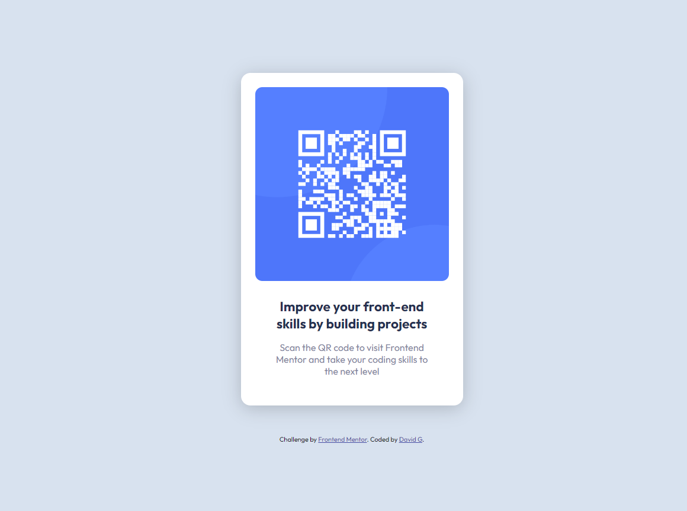

# FM_qr_chalenge
Frontend Mentor QR code challange

This is a solution to the [QR code component challenge on Frontend Mentor](https://www.frontendmentor.io/challenges/qr-code-component-iux_sIO_H). Frontend Mentor challenges help you improve your coding skills by building realistic projects. 

## Screenshot

## Links
- Solution URL: https://github.com/davidgrossmann/FM_qr_chalenge

## What I learned

I have practiced my knowledge of HTML and CSS

